<p align="center">
  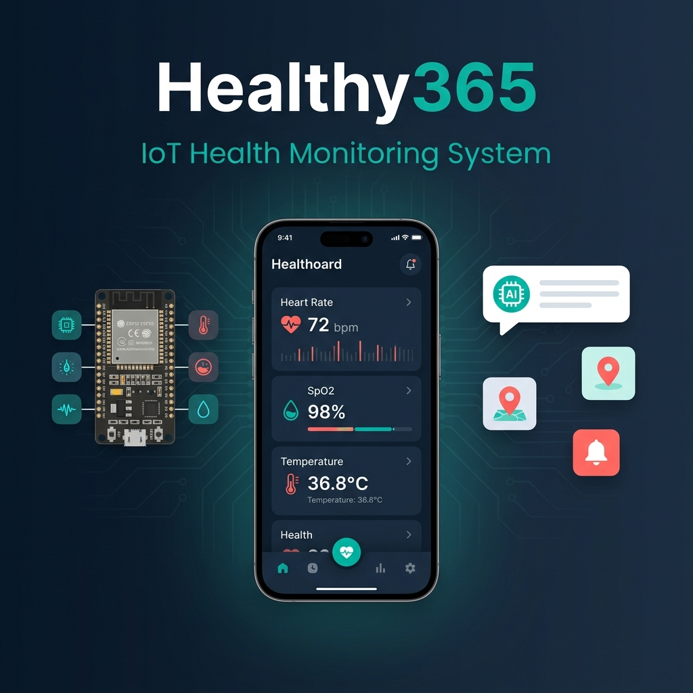
</p>

<h1 align="center">🏥 Healthy365 — IoT Health Monitoring System</h1>

<p align="center">
  <strong>Hệ thống giám sát sức khỏe thời gian thực tích hợp IoT</strong>
</p>

<p align="center">
  <em>A comprehensive Android application for remote health monitoring, integrating ESP32 IoT sensors with AI-powered medical assistance and real-time emergency response.</em>
</p>

<p align="center">
  <a href="#-key-features--tính-năng-chính"></a>
  <a href="#-tech-stack--công-nghệ"></a>
  <a href="#-tech-stack--công-nghệ"></a>
  <a href="#-tech-stack--công-nghệ"></a>
  <a href="LICENSE"></a>
</p>

<p align="center">
  <a href="#-getting-started--bắt-đầu">Getting Started</a> •
  <a href="#-key-features--tính-năng-chính">Features</a> •
  <a href="#-architecture--kiến-trúc">Architecture</a> •
  <a href="#-tech-stack--công-nghệ">Tech Stack</a> •
  <a href="docs/ARCHITECTURE.md">Documentation</a>
</p>

---

## 📝 About / Giới thiệu

**EN:** Healthy365 is a real-time health monitoring Android application designed for **remote patient care**. The system connects to ESP32-based wearable devices equipped with biomedical sensors (MAX30102, MPU6050, DS18B20) to continuously track vital signs including heart rate, SpO2, body temperature, and fall detection. The app features an AI-powered medical assistant (Google Gemini), interactive hospital finder with Google Maps, and intelligent emergency alert system.

**VN:** Healthy365 là ứng dụng Android giám sát sức khỏe thời gian thực, được thiết kế cho việc **chăm sóc bệnh nhân từ xa**. Hệ thống kết nối với thiết bị đeo ESP32 tích hợp cảm biến y sinh (MAX30102, MPU6050, DS18B20) để theo dõi liên tục các chỉ số sinh hiệu bao gồm nhịp tim, SpO2, thân nhiệt và phát hiện té ngã. Ứng dụng tích hợp trợ lý y tế AI (Google Gemini), tìm bệnh viện gần nhất với Google Maps, và hệ thống cảnh báo khẩn cấp thông minh.

### 🎯 Problem Statement / Vấn đề giải quyết

> Vietnam has a growing elderly population with limited access to continuous health monitoring. Traditional methods require frequent hospital visits, which is inconvenient and costly. This project provides a **low-cost, real-time, and intelligent** health monitoring solution accessible via smartphone.

> Việt Nam có dân số già hóa nhanh với khả năng tiếp cận giám sát sức khỏe liên tục còn hạn chế. Phương pháp truyền thống yêu cầu khám bệnh viện thường xuyên, gây bất tiện và tốn kém. Dự án này cung cấp giải pháp giám sát sức khỏe **chi phí thấp, thời gian thực, và thông minh** thông qua điện thoại di động.

---

## ✨ Key Features / Tính năng chính

<table>
<tr>
<td width="50%">

### 📊 Real-time Vital Monitoring
**Giám sát sinh hiệu thời gian thực**

- ❤️ Heart Rate (BPM) with animated pulse
- 🫁 Blood Oxygen Saturation (SpO2)
- 🌡️ Body Temperature
- 🌫️ Air Quality (PM2.5)
- Semantic color-coded status indicators
- Auto-offline detection (>60s timeout)

</td>
<td width="50%">

### 🤖 AI Medical Assistant
**Trợ lý y tế AI thông minh**

- Powered by Google Gemini API
- Context-aware health advice
- Voice input with waveform visualization
- Image attachment for medical records
- Markdown-formatted responses
- Quick action suggestion buttons

</td>
</tr>
<tr>
<td width="50%">

### 🗺️ Emergency Hospital Finder
**Tìm bệnh viện khẩn cấp**

- Google Maps integration
- Overpass API for nearby hospitals
- Custom medical-themed map style
- 1-tap location sharing via Zalo/SMS
- Distance calculation & navigation

</td>
<td width="50%">

### 🚨 Intelligent Alert System
**Hệ thống cảnh báo thông minh**

- Fall detection (MPU6050 accelerometer)
- SOS emergency button
- Remote buzzer cancellation
- Push notifications (Firebase)
- Foreground monitoring service
- Alert history with smart filtering

</td>
</tr>
<tr>
<td width="50%">

### 📈 Health Analytics & Reports
**Phân tích & báo cáo sức khỏe**

- Interactive line charts (7-day history)
- Real-time waveform visualization
- Health distribution pie charts
- PDF report generation & sharing
- AI-powered trend analysis

</td>
<td width="50%">

### 🔐 Security & Device Management
**Bảo mật & quản lý thiết bị**

- Firebase Authentication (Email/Password)
- OTP phone verification
- QR code device pairing
- Privacy controls (show/hide info)
- Secure API key management

</td>
</tr>
</table>

---

## 📱 Screenshots / Ảnh chụp màn hình

> **Note:** Replace the placeholder images below with actual screenshots of your app.

<p align="center">
  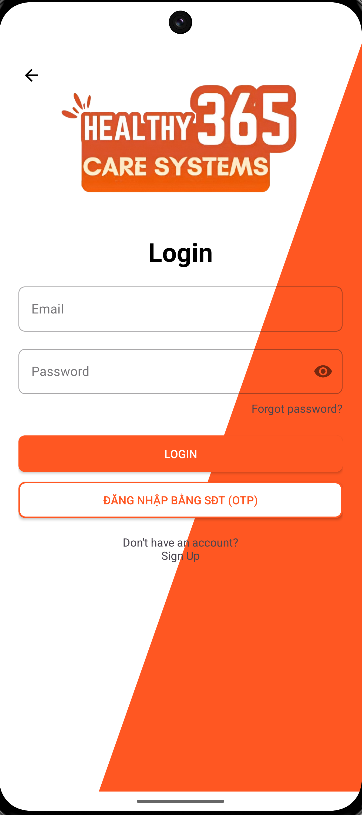
  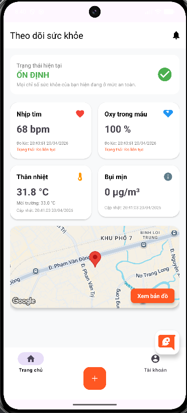
  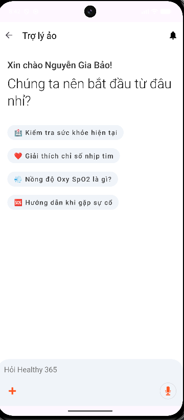
  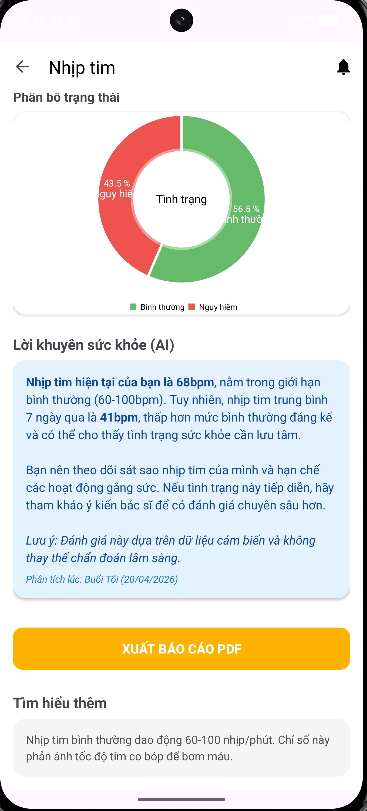
</p>

<p align="center">
  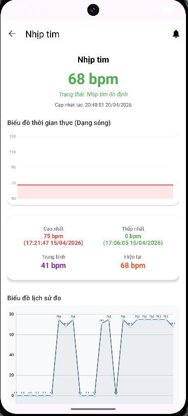
  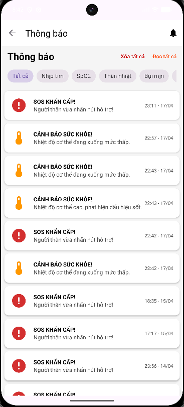
  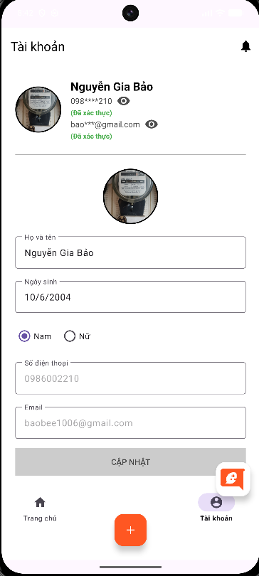
  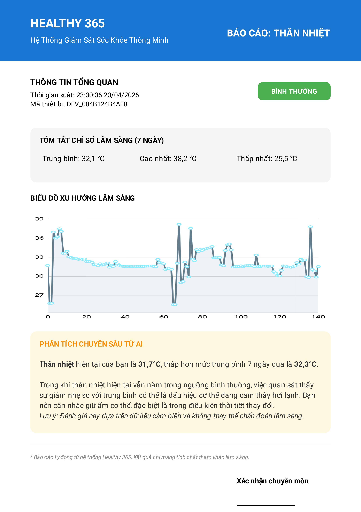
</p>

<p align="center">
  <sub>From left to right: Login • Home Dashboard • AI Assistant • Hospital Map • Metric Detail • Notifications • Account • PDF Report</sub>
</p>

---

## 🏗️ Architecture / Kiến trúc

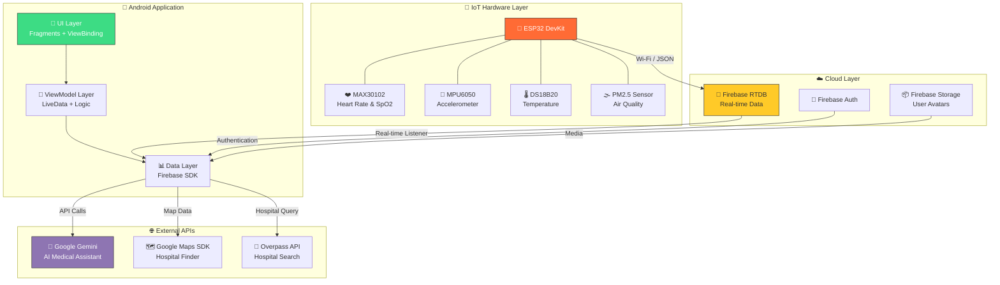

### Data Flow / Luồng dữ liệu

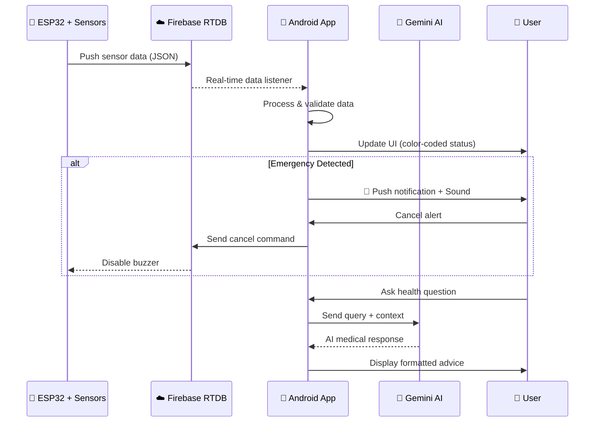

---

## 🛠️ Tech Stack / Công nghệ

| Category | Technology | Purpose |
|----------|-----------|---------|
| **Platform** | Android (API 24+) | Mobile application |
| **Language** | Java 11 | Primary development language |
| **UI Framework** | ViewBinding + XML | Type-safe view access |
| **Architecture** | MVVM | Model-View-ViewModel pattern |
| **Navigation** | Jetpack Navigation | Fragment-based navigation with deep links |
| **Authentication** | Firebase Auth | Email/Password + Phone OTP |
| **Real-time Data** | Firebase Realtime Database | Sensor data streaming |
| **Storage** | Firebase Storage | User avatar management |
| **AI Assistant** | Google Gemini API | Medical consultation chatbot |
| **Maps** | Google Maps SDK | Hospital finder & location |
| **Hospital Search** | Overpass API (OpenStreetMap) | Nearby hospital discovery |
| **Charts** | MPAndroidChart | Vital sign visualization |
| **Animations** | Lottie | Splash screen & micro-animations |
| **QR Scanner** | ZXing | Device pairing via QR code |
| **Markdown** | Markwon | AI response formatting |
| **Image Loading** | Glide | Efficient image loading & caching |
| **Notifications** | Foreground Service | Background health monitoring |
| **IoT Hardware** | ESP32 + MAX30102 + MPU6050 | Sensor data collection |

---

## 📂 Project Structure / Cấu trúc dự án

```
app/src/main/java/com/example/loginanimatedapp/
├── 📱 MainActivity.java              # Login/Register flow with animations
├── 📊 DashboardActivity.java         # Main dashboard with bottom navigation
├── 📷 AddDeviceActivity.java         # QR code device pairing
├── 🔧 CustomCaptureActivity.java     # Custom QR scanner UI
├── 🌐 MyApplication.java            # Application class initialization
│
├── 🎨 ui/                           # UI Layer (Fragments)
│   ├── home/
│   │   ├── HomeFragment.java         # Real-time vital monitoring dashboard
│   │   └── FullMapFragment.java      # Expanded map view
│   ├── dashboard/
│   │   ├── DashboardFragment.java    # Google Maps hospital finder
│   │   ├── DashboardViewModel.java   # Map data management
│   │   ├── MetricDetailFragment.java # Detailed charts & PDF export
│   │   └── CustomMarkerView.java     # Chart tooltip component
│   ├── chat/
│   │   ├── ChatFragment.java         # AI medical assistant (Gemini)
│   │   ├── ChatAdapter.java          # Chat bubble RecyclerView adapter
│   │   └── ChatViewModel.java        # Chat state management
│   ├── notifications/
│   │   ├── NotificationsFragment.java    # Alert history with filters
│   │   ├── NotificationsAdapter.java     # Notification list adapter
│   │   └── NotificationDetailFragment.java # Individual alert details
│   └── account/
│       ├── AccountFragment.java      # User profile & device management
│       ├── AccountViewModel.java     # Profile data management
│       └── OtpFragment.java          # Phone number OTP verification
│
├── 🤖 chatbot/
│   └── Chatbot.java                  # Gemini AI integration logic
│
├── 📦 model/
│   ├── ChatMessage.java              # Chat message data class
│   ├── Notification.java            # Alert notification data class
│   └── User.java                     # User profile data class
│
├── 🔔 service/
│   └── NotificationService.java      # Foreground monitoring service
│
├── 🔌 adapter/
│   └── ChatAdapter.java             # Global chat adapter
│
└── 🛠️ utils/
    └── NotificationHelper.java       # Notification channel management
```

---

## ⚙️ Getting Started / Bắt đầu

### Prerequisites / Yêu cầu

- **Android Studio** Ladybug (2024.2+) or newer
- **JDK 11** or higher
- **Android SDK** API Level 24+ (Android 7.0)
- **Google Maps API Key** ([Get one here](https://console.cloud.google.com/google/maps-apis))
- **Google Gemini API Key** ([Get one here](https://aistudio.google.com/apikey))
- **Firebase Project** with Authentication & Realtime Database enabled

### Installation / Cài đặt

1. **Clone the repository / Clone repo:**
   ```bash
   git clone https://github.com/nguyengiabao100624/healthy365-android.git
   cd healthy365-android
   ```

2. **Firebase setup / Cấu hình Firebase:**
   - Create a Firebase project at [Firebase Console](https://console.firebase.google.com)
   - Enable **Email/Password** and **Phone** authentication
   - Enable **Realtime Database** (Asia Southeast region)
   - Download `google-services.json` and place it in the `app/` directory

3. **API Keys configuration / Cấu hình API keys:**
   
   Create `local.properties` in the project root:
   ```properties
   # Google Maps API Key
   MAPS_API_KEY=your_google_maps_api_key_here
   
   # Google Gemini API Key  
   GEMINI_API_KEY=your_gemini_api_key_here
   ```

4. **Build & Run / Build & Chạy:**
   ```bash
   # Open in Android Studio and sync Gradle
   # Or build from command line:
   ./gradlew assembleDebug
   ```

5. **Hardware Setup (Optional) / Cài đặt phần cứng:**
   - Flash ESP32 with firmware from [DAKT1 Repository](https://github.com/Danhnguyenquang/DAKT1)
   - Connect sensors: MAX30102, MPU6050, DS18B20, PM2.5
   - Configure Wi-Fi credentials on ESP32
   - Pair device with app via QR code

---

## 🔧 Firebase Database Schema

```json
{
  "Users": {
    "<uid>": {
      "name": "string",
      "email": "string",
      "phone": "string",
      "deviceID": "string",
      "profileImageUrl": "string"
    }
  },
  "SensorData": {
    "<deviceID>": {
      "HeartRate": 75,
      "SpO2": 98,
      "Temperature": 36.5,
      "PM25": 12.3,
      "FallDetected": false,
      "SOS": false,
      "DeviceTime": 1234567890,
      "Latitude": 10.762622,
      "Longitude": 106.660172
    }
  },
  "Control": {
    "<deviceID>": {
      "Cmd_CancelAlert": false
    }
  },
  "Notifications": {
    "<uid>": {
      "<notificationId>": {
        "title": "string",
        "message": "string",
        "type": "heart_rate|spo2|temperature|fall|sos",
        "timestamp": 1234567890,
        "isRead": false
      }
    }
  }
}
```

---

## 🔗 Related Repositories / Repo liên quan

| Repository | Description |
|-----------|-------------|
| [**DAKT1** — Embedded Firmware](https://github.com/Danhnguyenquang/DAKT1) | ESP32 firmware with sensor drivers, fall detection algorithm, and Firebase integration |
| **healthy365-android** (this repo) | Android mobile application |

---

## 👨‍💻 Author / Tác giả

<table>
  <tr>
    <td align="center">
      <a href="https://github.com/nguyengiabao100624">
        
        <br />
        <sub><b>Nguyễn Gia Bảo</b></sub>
      </a>
      <br />
      <sub>📱 Mobile App Developer</sub>
      <br />
      <a href="https://github.com/nguyengiabao100624" title="GitHub">
        
      </a>
    </td>
  </tr>
</table>

---

## 📄 License / Giấy phép

This project is licensed under the **MIT License** — see the [LICENSE](LICENSE) file for details.

Dự án này được cấp phép theo **Giấy phép MIT** — xem file [LICENSE](LICENSE) để biết chi tiết.

---

## 🙏 Acknowledgments / Lời cảm ơn

- **[Firebase](https://firebase.google.com/)** — Real-time database & authentication
- **[Google Gemini](https://ai.google.dev/)** — AI-powered medical assistant
- **[Google Maps Platform](https://developers.google.com/maps)** — Hospital finder & navigation
- **[MPAndroidChart](https://github.com/PhilJay/MPAndroidChart)** — Beautiful chart visualizations
- **[Lottie](https://lottiefiles.com/)** — Smooth animations
- **[Markwon](https://github.com/noties/markwon)** — Markdown rendering
- **[ZXing](https://github.com/zxing/zxing)** — QR code scanning
- **[Overpass API](https://overpass-api.de/)** — OpenStreetMap hospital queries
- **Industrial University of Ho Chi Minh City (IUH)** — Academic support

---

<p align="center">
  Made with ❤️ for better healthcare
  <br/>
  <sub>Được tạo với ❤️ vì sức khỏe cộng đồng</sub>
</p>
