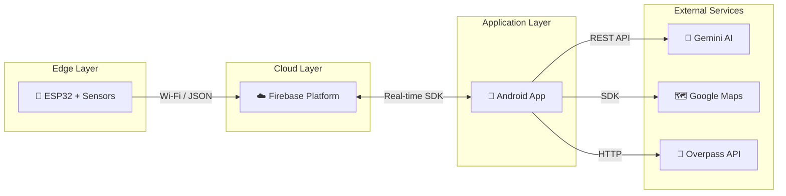
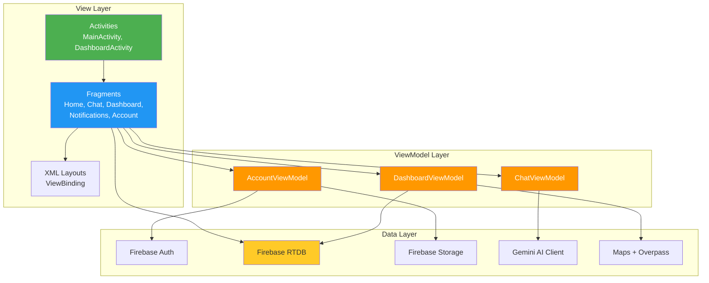
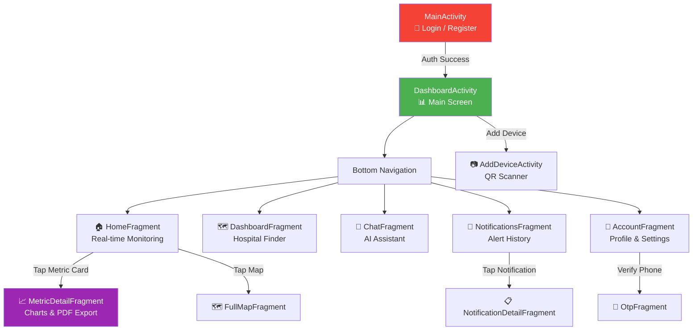
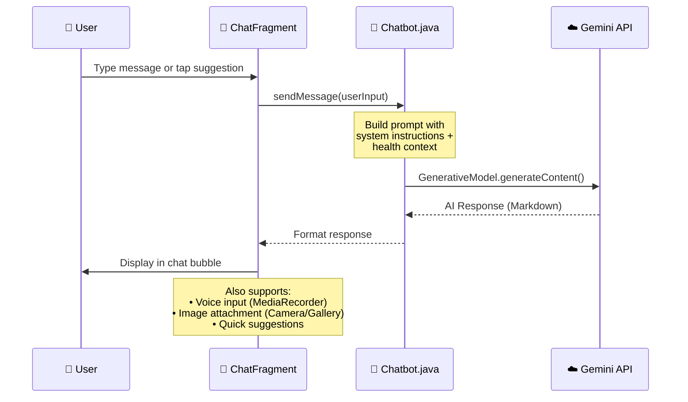
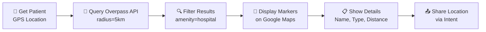
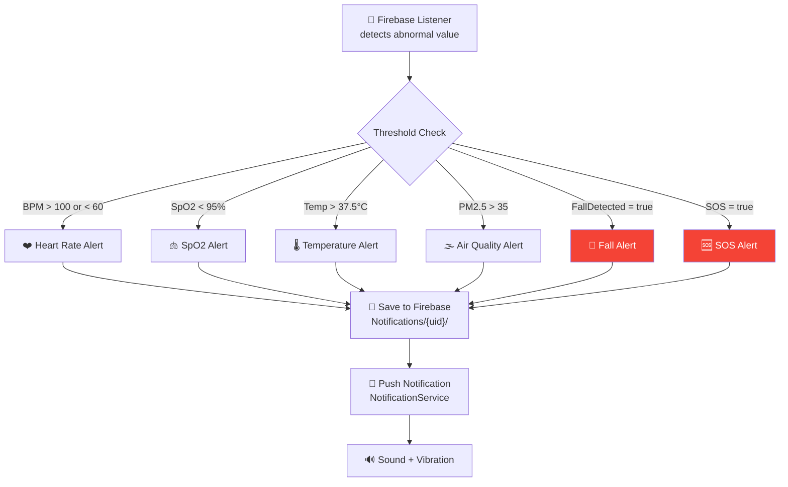

# 🏗️ System Architecture / Kiến trúc hệ thống

> **Healthy365** follows a layered architecture with clear separation of concerns between the IoT hardware, cloud services, and mobile application.

---

## 📐 High-Level Overview



---

## 📱 Android Application Architecture

The app follows the **MVVM (Model-View-ViewModel)** pattern with the following layers:



---

## 🧭 Navigation Architecture



---

## ☁️ Firebase Database Structure

### Real-time Data Nodes

```
Firebase Realtime Database
│
├── 📁 Users/
│   └── {uid}/
│       ├── name: "Nguyễn Văn A"
│       ├── email: "user@example.com"
│       ├── phone: "+84123456789"
│       ├── deviceID: "ESP32_001"
│       ├── gender: "male"
│       ├── birthday: "1990-01-01"
│       └── profileImageUrl: "https://..."
│
├── 📁 SensorData/
│   └── {deviceID}/
│       ├── HeartRate: 75          ← Updated every ~2s
│       ├── SpO2: 98              ← Updated every ~2s
│       ├── Temperature: 36.5     ← Updated every ~5s
│       ├── PM25: 12.3            ← Updated every ~10s
│       ├── FallDetected: false   ← Event-driven
│       ├── SOS: false            ← Event-driven
│       ├── DeviceTime: 1716789... ← Unix timestamp
│       ├── Latitude: 10.762622
│       └── Longitude: 106.660172
│
├── 📁 Control/
│   └── {deviceID}/
│       └── Cmd_CancelAlert: false  ← Written by app
│
├── 📁 Notifications/
│   └── {uid}/
│       └── {notificationId}/
│           ├── title: "⚠️ Cảnh báo nhịp tim"
│           ├── message: "BPM: 120 - Cao hơn bình thường"
│           ├── type: "heart_rate"
│           ├── timestamp: 1716789...
│           └── isRead: false
│
└── 📁 History/
    └── {deviceID}/
        └── {date}/
            └── {timestamp}/
                ├── heartRate: 75
                ├── spo2: 98
                └── temperature: 36.5
```

### Data Flow Patterns

| Pattern | Direction | Frequency | Description |
|---------|-----------|-----------|-------------|
| Sensor Push | ESP32 → Firebase | 2-10s | Continuous vital signs |
| Real-time Listen | Firebase → App | Instant | `ValueEventListener` |
| Command Write | App → Firebase | On-demand | Cancel alert, control |
| History Query | Firebase → App | On-demand | Chart data loading |
| Auth Flow | App ↔ Firebase | On-demand | Login/Register/OTP |

---

## 🔌 IoT Hardware Integration

### Sensor Specifications

| Sensor | Measurement | Interface | Sampling Rate |
|--------|------------|-----------|---------------|
| **MAX30102** | Heart Rate, SpO2 | I2C | ~100 Hz (raw), 2s (processed) |
| **MPU6050** | Acceleration (Fall Detection) | I2C | 100 Hz |
| **DS18B20** | Body Temperature | OneWire | Every 5s |
| **PM2.5 Sensor** | Air Quality (μg/m³) | Analog/UART | Every 10s |

### ESP32 → Firebase Communication

```
ESP32 Boot
    │
    ├── Connect Wi-Fi
    ├── Initialize Firebase Client
    ├── Initialize Sensors
    │
    └── Main Loop (FreeRTOS Tasks)
        ├── Task 1: Read MAX30102 → Calculate BPM/SpO2
        ├── Task 2: Read MPU6050 → Fall Detection Algorithm
        ├── Task 3: Read DS18B20 → Temperature
        ├── Task 4: Read PM2.5 → Air Quality
        │
        └── Push JSON to Firebase RTDB
            {
              "HeartRate": 75,
              "SpO2": 98,
              "Temperature": 36.5,
              "PM25": 12.3,
              "FallDetected": false,
              "DeviceTime": 1716789000
            }
```

---

## 🤖 AI Integration Architecture

### Gemini AI Medical Assistant



### System Prompt Strategy

The AI assistant uses a carefully crafted system prompt that:
1. **Role**: Acts as "Healthy 365" medical professional
2. **Language**: Responds in Vietnamese
3. **Safety**: Includes emergency escalation rules (SpO2 < 90% → immediate hospital)
4. **Context**: Receives current sensor data for personalized advice
5. **Limitations**: Disclaims that AI advice doesn't replace professional medical care

---

## 🗺️ Maps & Hospital Finder

### Hospital Search Flow



### Overpass API Query

```
[out:json][timeout:30];
(
  node["amenity"="hospital"](around:5000,{lat},{lon});
  way["amenity"="hospital"](around:5000,{lat},{lon});
);
out center;
```

---

## 🔔 Notification System

### Alert Processing Pipeline



### Foreground Service

The `NotificationService` runs as an **Android Foreground Service** (`FOREGROUND_SERVICE_DATA_SYNC`) to ensure continuous monitoring even when the app is in the background. It:

1. Maintains a persistent Firebase listener
2. Evaluates incoming sensor data against health thresholds  
3. Creates high-priority notifications for critical alerts
4. Manages notification channels (Emergency, Info, Service)

---

*For API-level documentation, see [API_REFERENCE.md](API_REFERENCE.md)*
